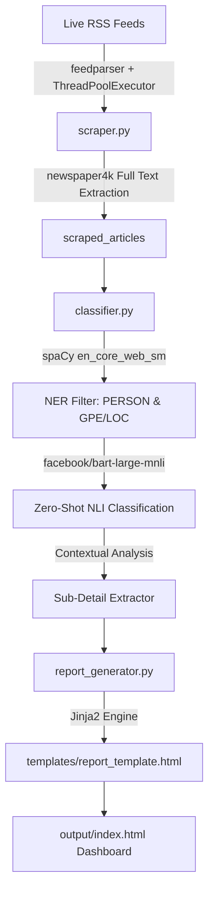

# Automated NLP News Intelligence & Entity Categorization Pipeline

An end-to-end Python-based Data Engineering and NLP pipeline that ingests live RSS news feeds from major media outlets (*Times of India, The Hindu, NDTV, India Today, Indian Express*), extracts full article text, performs Named Entity Recognition (NER) and Zero-Shot Classification, and generates a dynamic HTML analytics dashboard.

---

## 🌟 Key Features

* **Multi-Threaded Live RSS Ingestion:** Parallel article scraping across 5 major Indian news portals using `feedparser`, `newspaper4k`, and `ThreadPoolExecutor`.
* **Resilient 403 Fallback System:** Automatically handles anti-bot HTTP 403 blocks with graceful fallbacks to RSS summary snippets.
* **Two-Stage NLP Engine:**
  * **spaCy (`en_core_web_sm`):** High-speed Named Entity Recognition (NER) for proper nouns (`PERSON`) and locations (`GPE`/`LOC`).
  * **Hugging Face (`facebook/bart-large-mnli`):** Zero-Shot Natural Language Inference (NLI) classification into domain categories (*Sportsperson, Politician, Author, Actor, Businessman, Government Official*).
  * **Contextual Sub-Extraction:** Contextual details (specific sports like Cricket/Football, political parties like BJP/Congress via regex, published book titles).
* **Channel & Time-Slot Analytics:** Segmented time-window analysis (*Morning, Afternoon, Evening, Night*) calculating channel-wise category dominance.
* **In-Memory Caching:** Performance-optimized entity classification caching (`CLASSIFICATION_CACHE`) minimizing redundant transformer inference.
* **Dynamic HTML Dashboard:** Jinja2 templated dashboard featuring modern dark-mode CSS styling, category badges, exact timestamp formatting, and source links.

---

## 📁 Repository Architecture

```text
news.pyp/
├── config.py                 # Centralized configuration & hyperparameters
├── scraper.py                # Multi-threaded RSS fetcher & newspaper4k scraper
├── classifier.py             # spaCy NER & Hugging Face BART zero-shot classifier
├── report_generator.py       # Time-slot analytics compute & Jinja2 renderer
├── main.py                   # Master pipeline orchestrator
├── output/
│   └── index.html            # Generated HTML intelligence dashboard
├── templates/
│   └── report_template.html  # Jinja2 HTML/CSS dashboard template
└── requirements.txt          # Python dependencies
```

---

## 🚀 Quick Start

### 1. Install Dependencies
```bash
pip install -r requirements.txt
python -m spacy download en_core_web_sm
```

### 2. Run the Pipeline
```bash
python main.py
```

### 3. View the Intelligence Dashboard
Open `output/index.html` in any modern web browser.

---

## 📊 Technical Architecture & NLP Deep Dive



---

## 📄 License
This project is open-source under the MIT License.
